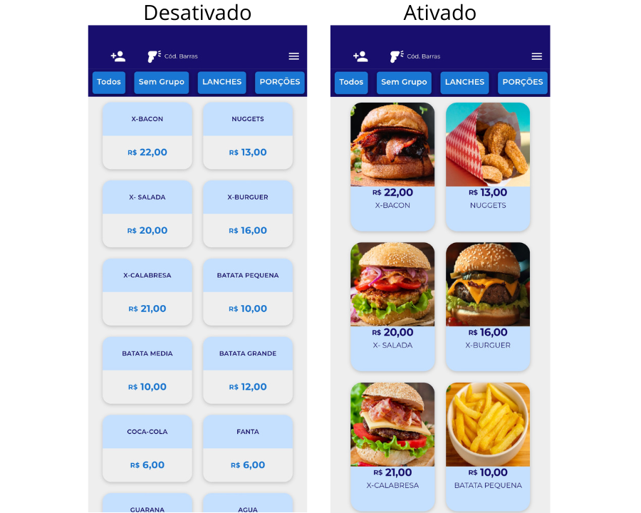
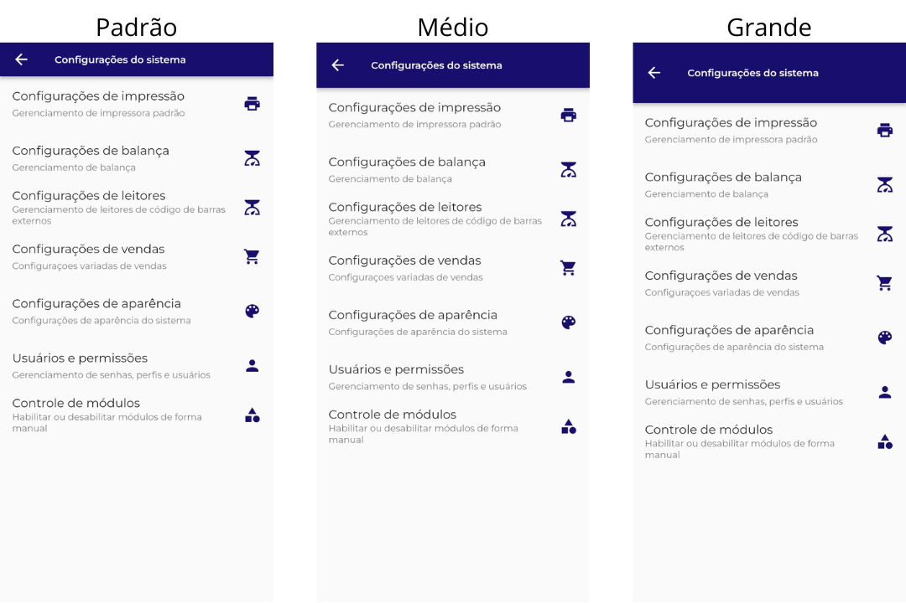
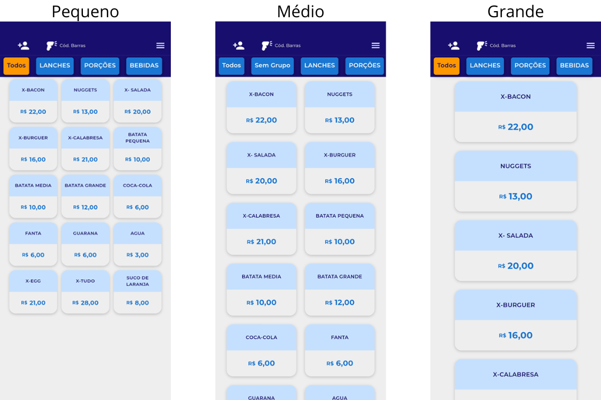

# <b> Configurações de Aparências: <b>

Os parâmetros de configurações de aparência são utilizados para personalizar o Xpos para o estilo de sistema que o cliente deseja, temos diversos parâmetros como a cor principal, logotipo e entre outros.

- Utilizar foto de produtos:

Quando habilitado, permite a exibição da foto do produto na tela de vendas.

<figure markdown>
  
</figure>

- Carrinho no lado esquerdo da tela:

O carrinho de compras aparecerá do lado esquerdo da tela.

<figure markdown>
  <figcaption>Parâmetro desativado</figcaption>
  
</figure>

<figure markdown>
  <figcaption>Parâmetro ativado</figcaption>
  
</figure>

- Habilitar tema escuro:

Quando habilitado, usa o tema escuro do aplicativo.

<figure markdown>
  
</figure>

- Utilizar o logo do tipo da loja:

Quando habilitado permite alterar o logotipo da loja.

<figure markdown>
  <figcaption>:</figcaption>
  
</figure>

- Personalizar o autoatendimento:

Quando habilitado, permite alterar o papel de parede do autoatendimento.

<figure markdown>
  <figcaption>:</figcaption>
  
</figure>

- Utilizar slide:

Adicione Slide no autoatendimento.

<figure markdown>
  <figcaption>:</figcaption>
  
</figure>

- Cabeçalho personalizado:

Quando habilitado, permite alterar o tamanho do cabeçalho.

<figure markdown>
  
</figure>

- Tamanho do card:

Defina o tamanho dos cards para vendas com catálogo.

<figure markdown>
  
</figure>

- Utilizar multi-telas:

Este parâmetro permite que o aplicativo seja utilizado em multi telas (Funciona em somente android).

- Cor principal do aplicativo:

Quando selecionado a cor, muda a cor principal do aplicativo.

<figure markdown>
  <figcaption>Cores de temas</figcaption>
  
</figure>
