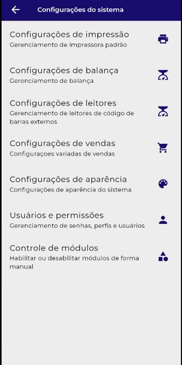

# **Configurações de Balanças:**

O Xpos pode ser configurado apenas com balança Bluetooth, mas você pode ativar o parâmetro “Pesagem manual” e  utilizar uma balança para gerar a etiqueta de peso e inserir o valor manual na hora de inserir o produto.

### **Segue o vídeo para configuração de impressora bluetooth:**

<figure markdown>
  <figcaption>Configurando balança Bluetooth</figcaption>
  
</figure>

