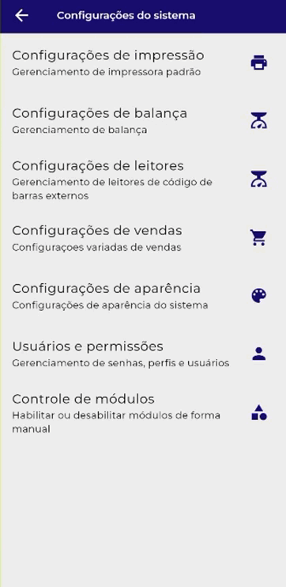

# <b> Configurações de Permissões: <b>

- Utilizar senha do dia:

Quando habilitado, é utilizado a senha do dia (disponível no site ….) para bloqueio de algumas funcionalidades do usuário, para assim evitar fraudes.

- Utilizar senha interna do estabelecimento:

Quando habilitado, ele tem a mesma função do “Utilizar a senha do dia”, porém você escolhe a senha que deseja utilizar.

<figure markdown>
  <figcaption>Exemplo de configuração</figcaption>
  
</figure>

- Utilizar senha para cancelamentos:

Quando habilitado, é necessário informar a senha de segurança para cancelar uma venda.

- Utilizar senha para acesso a configurações:

Quando habilitado, é necessário informar a senha de segurança para acessar as configurações do sistema.

- Utilizar senha para o acesso a cadastros:

Quando habilitado, é necessário informar a senha de segurança para acessar o cadastros do sistemas ( Sistema integrado com o PDV não tem módulo de cadastros).

- Utilizar senha para acesso de relatórios:

Quando habilitado, é necessário informar a senha de segurança para acessar os relatórios.

- Utilizar senha para descontos:

Quando habilitado, é necessário informar a senha de segurança para conceder descontos e acréscimos em vendas.
