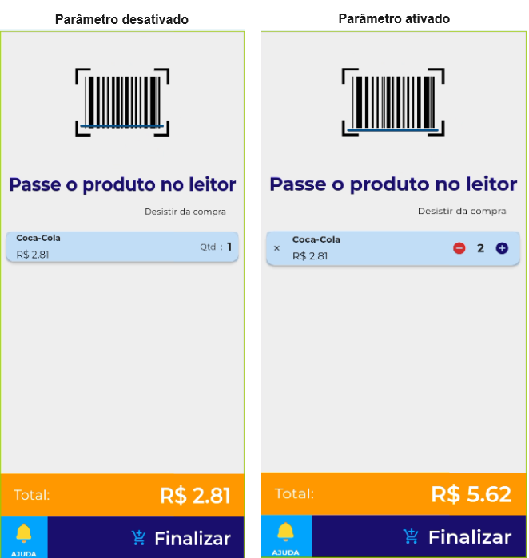

# **Configurações de Vendas:**

### **Parâmetro de vendas gerais**

 **- Utilizar segunda via do cupom:**

Quando habilitado, permite a impressão da segunda via do cupom;

**- Quantidade no autoatendimento:**

Quando habilitado, permite ao consumidor controlar a quantidade de produtos no autoatendimento;

<figure markdown>
  
</figure>

**- Checkout automático em dinheiro:**

Quando habilitado, ao clicar no valor a venda é finalizada automaticamente;

<iframe width="560" height="315" src="https://www.youtube.com/embed/NEmItThqRm4?si=gj2zMWKgqwYuMxxV" title="YouTube video player" frameborder="0" allow="accelerometer; autoplay; clipboard-write; encrypted-media; gyroscope; picture-in-picture; web-share" allowfullscreen></iframe>

### Parâmetros de pagamentos

**- Venda fiscal integrada:**

Habilite para fazer vendas fiscais via integração com DJPDV;

<iframe width="560" height="315" src="https://www.youtube.com/embed/0m5vecdOYuQ?si=wbEhYFrVLg1tZ5ed" title="YouTube video player" frameborder="0" allow="accelerometer; autoplay; clipboard-write; encrypted-media; gyroscope; picture-in-picture; web-share" allowfullscreen></iframe>

!!! warning "Atenção!!!"
    Para a configuração da integração todos os dispositivos tem que estar 
    na mesma rede, caso o contrário, ocorrerá falha na comunicação.

**- Habilitar integração com TEF**

Suporte para maquininha da Rede

<iframe width="560" height="315" src="https://www.youtube.com/embed/4uE0sJOpOSc?si=qrFCh1L0rMrFwcYH" title="YouTube video player" frameborder="0" allow="accelerometer; autoplay; clipboard-write; encrypted-media; gyroscope; picture-in-picture; web-share" allowfullscreen></iframe>

### **Parâmetros de cartão presente**

**- Habilitar cartão presente:**

Quando habilitado, permite a utilização de códigos de resgate e cartões presente.

<iframe width="560" height="315" src="https://www.youtube.com/embed/SS3SLte9Mso?si=U1RojVfWR-qhkEac" title="YouTube video player" frameborder="0" allow="accelerometer; autoplay; clipboard-write; encrypted-media; gyroscope; picture-in-picture; web-share" allowfullscreen></iframe>
