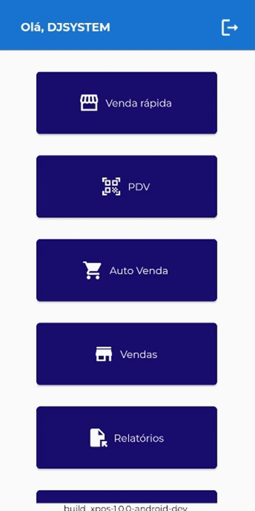
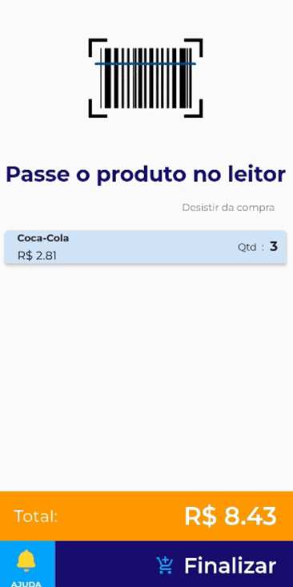

# <b> Realizando venda no Módulo Venda Rápida <b>

1 - Clique em "Auto Venda" para acessar o módulo;

<figure markdown>
  
  <figcaption>Clique em Auto Venda</figcaption>
</figure>

2 - Clique na tela para iniciar

2.1 - Insira seu CPF caso queira colocar na nota ou clique em continuar sem CPF

<figure markdown>
  
  <figcaption>Insira o CPF ou clique em continuar sem CPF</figcaption>
</figure>

3 - Passe o produto no código de barras

<figure markdown>
  
  <figcaption>Bipe o produto com o leitor de código de barras</figcaption>
</figure>

4 - Clique em finalizar;

4.1 - Depois selecione a forma de pagamento;
<figure markdown>
  
  <figcaption>Nesse exemplo foi selecionado o Pix</figcaption>
</figure>

!!! warning "Integração com TEF"
       Para utilização do autoatendimento é necessário um TEF configurado.
       
