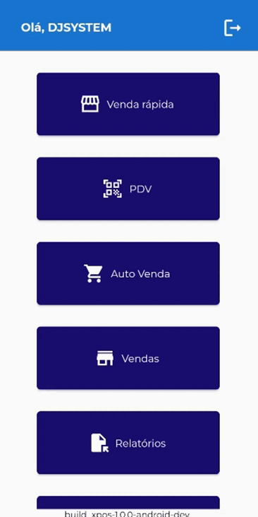
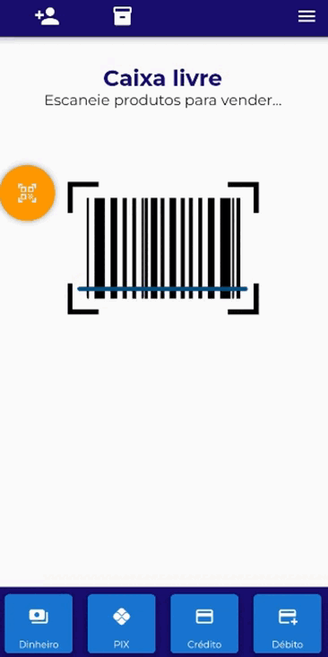
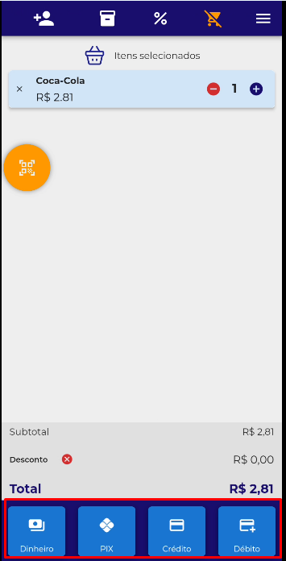
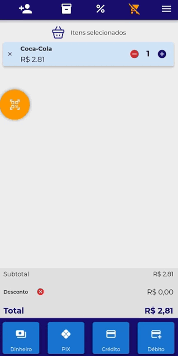

# <b> Realizando venda no Módulo Venda Rápida <b>

1 - Clique em "PDV" para acessar o módulo;

<figure markdown>
  
  <figcaption>Clique em PDV</figcaption>
</figure>

2 - Utilize o leitor para bipar um produto;

<figure markdown>
  
  <figcaption>Bipe os produtos</figcaption>
</figure>

2.1 - Pode também selecionar o produto utilizando a pesquisa do PDV;

<figure markdown>
  
  <figcaption>Selecione o produto</figcaption>
</figure>

3 - Após selecionar o produto, na parte inferior escolha a forma de pagamento.

<figure markdown>
  
  <figcaption>Selecione a Forma de Pagamento</figcaption>
</figure>

4 - Neste exemplo foi selecionado a forma de pagamento "Dinheiro";

<figure markdown>
  
  <figcaption>Clique no valor paga pelo o cliente ou insira o valor</figcaption>
</figure>

!!! info "Demais Formas de Pagamento"
        Caso selecione Pix, cartão de crédito e débito ele finalizara a venda após o clique.

!!! warning "Integração com TEF"
       Para emissão do comprovante de pagamento é necessário um TEF vinculado.
       Caso o contrário será somente registro da venda.
