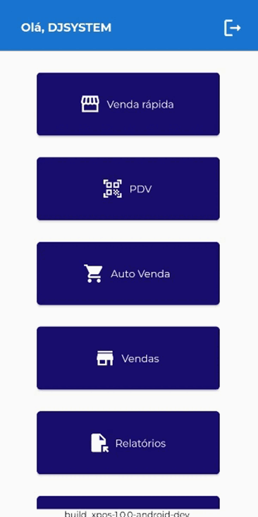
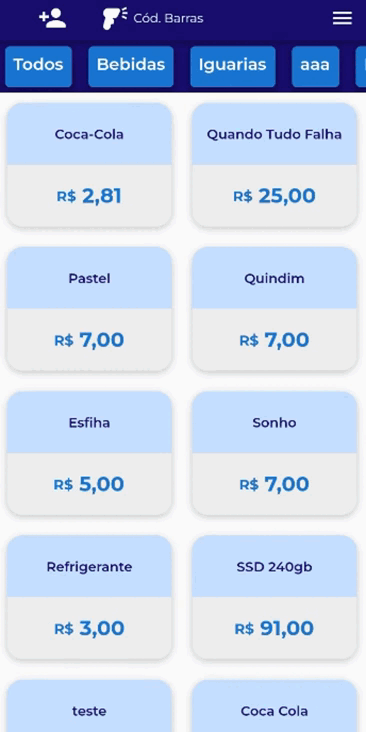
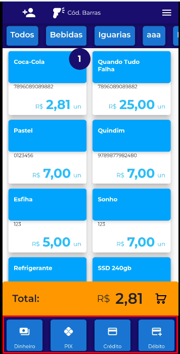
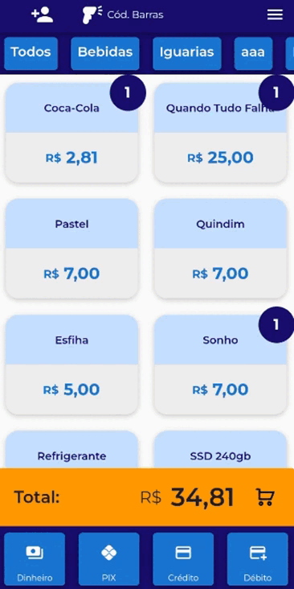

# **Realizando venda no Módulo Venda Rápida**

**1 - Clique em "Venda Rápida" para acessar o módulo:**

<figure markdown>
  
  <figcaption>Clique em Venda Rápida</figcaption>
</figure>

**2 - Selecione os produtos que deseja vender:**

<figure markdown>
  
  <figcaption>Clique nos produtos para vender</figcaption>
</figure>

**3 - Após selecionar o produto, na parte inferior vai aparecer as opções da forma de pagamento:**

<figure markdown>
  
  <figcaption>Selecione a Forma de Pagamento</figcaption>
</figure>

**4 - Neste exemplo foi selecionado a forma de pagamento "Dinheiro":**

<figure markdown>
  
  <figcaption>Clique no valor paga pelo o cliente ou insira o valor</figcaption>
</figure>

!!! info "Demais Formas de Pagamento"
        Caso selecione Pix, cartão de crédito e débito ele finalizara a venda após o clique.

!!! warning "Integração com TEF"
       Para emissão do comprovante de pagamento é necessário um TEF vinculado.
       Caso o contrário será somente registro da venda.
