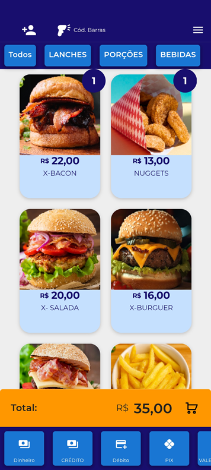

# **Realizando venda no Módulo Venda Rápida**

**1 - Clique em "Venda Rápida" para acessar o módulo e selecione os produtos para venda:**

<iframe width="560" height="315" src="https://www.youtube.com/embed/Q711nFBNjgg?si=Z5uQLjknzwVvPNw_&amp;start=3" title="YouTube video player" frameborder="0" allow="accelerometer; autoplay; clipboard-write; encrypted-media; gyroscope; picture-in-picture; web-share" allowfullscreen></iframe>

**2 - Após selecionar o produto, na parte inferior vai aparecer as opções da forma de pagamento:**

<figure markdown>
  
  <figcaption>Selecione a Forma de Pagamento</figcaption>
</figure>

**3 - Neste exemplo foi selecionado a forma de pagamento "Dinheiro":**

<iframe width="560" height="315" src="https://www.youtube.com/embed/OVpNX7PjAeQ?si=ZTytAvtJ-V9NROaN" title="YouTube video player" frameborder="0" allow="accelerometer; autoplay; clipboard-write; encrypted-media; gyroscope; picture-in-picture; web-share" allowfullscreen></iframe>

!!! info "Demais Formas de Pagamento"
        Caso selecione Pix, cartão de crédito e débito ele finalizara a venda após o clique.

!!! warning "Integração com TEF"
       Para emissão do comprovante de pagamento é necessário um TEF vinculado.
       Caso o contrário será somente registro da venda.
