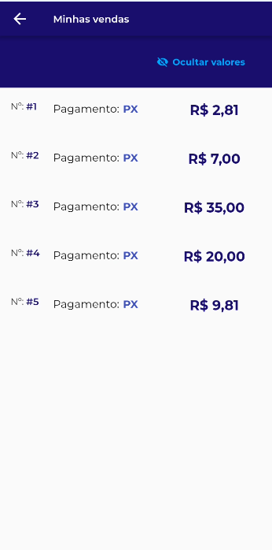
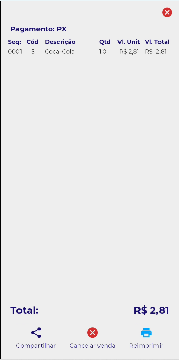

# **Módulo Vendas**

O módulo de vendas ele tem como intuito mostrar as vendas realizadas no dia, caso o funcionário precise revisar os produtos vendidos, valores ou até mesmo reimprimir ou cancelar a venda

<figure markdown>
  <figcaption>Vendas realizadas</figcaption>
  
</figure>

<figure markdown>
  <figcaption>Detalhes da venda</figcaption>
  
</figure>